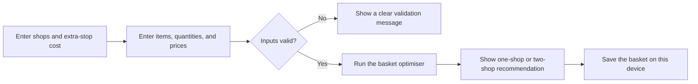
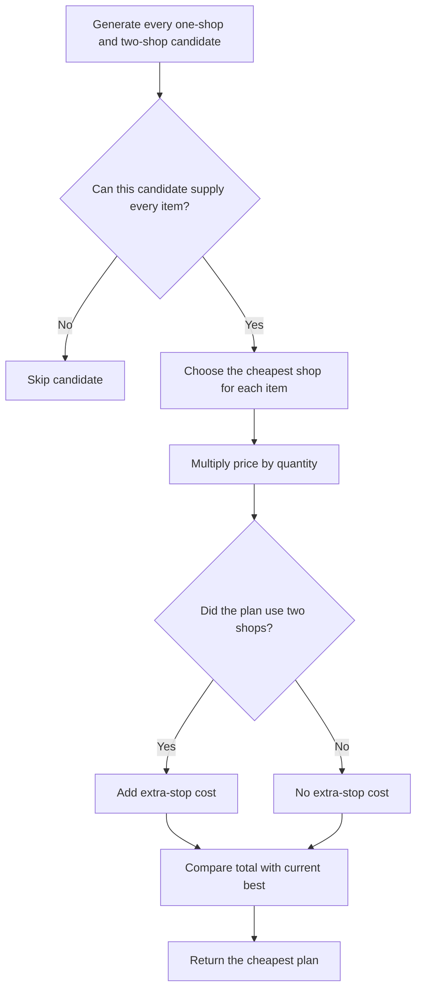

# BasketSplit - Submission Documentation

Live app: [basket-split-morris-zin.netlify.app](https://basket-split-morris-zin.netlify.app)

## What I built

I built BasketSplit for the Cheapest Basket topic. A user enters their shops, items, quantities, prices, and the estimated cost of one extra stop. The app recommends whether to buy everything from one shop or split the basket between two shops.

## How I approached it

I did not try to make the perfect algorithm immediately. I first built a dumb UI and connected the form state. This showed me what data the algorithm would actually receive. After that, I made simple domain types, built brute force, and only then wrote the faster optimiser.

My build order was roughly:

1. Build the shop and basket form without optimisation logic.
2. Define simple domain types for shops, items, prices, purchases, and plans.
3. Build a brute-force optimiser that tries every valid item-to-shop assignment.
4. Build the faster optimiser and compare its answers against brute force.
5. Connect the optimiser to the UI and show a useful recommendation.
6. Add local saving, PWA support, responsive styling, and validation.
7. Remove parts that felt overengineered, then test the finished workflow.

## Tools and architecture choices

I used React and TypeScript because the app has a connected form, and TypeScript catches mismatched data while I change the algorithm. I considered Python, but it would add another runtime or a backend. I wanted one small PWA that works in a browser and can be installed on mobile or desktop.

Vite keeps the setup small. My CSS originally grew into large files that were hard to safely change, so I moved the component styles to Tailwind. I used local storage instead of Supabase because the app does not need accounts or shared data. A database would add complexity without improving the main workflow.

The folders are separated by responsibility:

- `domain` contains the optimiser and plain TypeScript types. It does not import React, so the core logic can be copied into another TypeScript project.
- `application` contains editable form state, the reducer, sample data, and the conversion from form strings into a valid basket.
- `infrastructure` contains local-storage code.
- `components` contains the React UI.

Form values such as `"1.10"` stay as strings while the user is typing. After validation, money is converted into an integer in the smallest unit to avoid floating-point calculation problems.

## How the optimiser works

The brute-force version treats each item as one level of a decision tree and tries every shop selling that item. Every leaf is one complete plan. It is easy for me to understand, but the combinations grow quickly.

The faster optimiser changes the order of the problem. Since the app uses at most two shops, it generates every single shop and shop pair. For each candidate, it picks the cheapest available shop for each item, adds the extra-stop cost if two shops are really used, and keeps the cheapest total.

If two plans cost the same, the optimiser chooses fewer shops because there is no reason to make another stop without saving money. If they are still equal, it follows the user's shop order. Brute force is kept separately as a simple correctness oracle for small cases and is not used for normal recommendations.

## How I used AI

I used AI to discuss structure, draft code, find UI problems, and suggest edge cases. I did not accept every answer because some suggestions made the app larger without helping the challenge.

AI suggested Supabase, but I rejected it because local storage solves the current need. I also kept the domain folder because I wanted the optimiser independent from React. Later, I removed some extra tests and defensive storage validation because they were harder to maintain than the small feature they protected.

AI initially suggested starting with tests and sometimes used names that did not make sense to me. I chose to build the UI plumbing first and renamed concepts so I could clearly explain the code myself.

One AI suggestion that helped was moving the growing CSS into Tailwind classes beside each component. AI also helped trace a mobile overflow bug, but I checked the element widths myself and reran the app at 320 px after changing it.

I treated AI output as a draft, not proof. I read and simplified the code, compared both algorithms, ran the tests and build, and checked the deployed app in a real browser.

## Correctness and verification

I tested one-shop plans, useful and wasteful two-shop splits, equal totals, unavailable items, quantities, zero prices, and baskets requiring three shops.

The strongest check is the parity test. It creates all 4,096 small two-item price matrices across three shops, then checks each with two extra-stop costs. This compares the faster optimiser with brute force 8,192 times.

I also tested form conversion, the React workflow, recommendation changes, and saved data. Finally, I built the PWA and checked the deployed app at mobile and desktop sizes, including the 320 px layout that previously overflowed.

## Limitations and what I would improve

The app only considers one or two shops because that is the scope I chose for this challenge. Prices are entered manually and can become outdated. Data is only stored in one browser, so it does not sync across devices. The brute-force oracle is also meant for small test cases, not real user baskets.

If I continued the project, I would first test it with a few real users to see where entering many prices becomes confusing. After that, I might add a faster way to reuse a previous basket or import prices. I would not add accounts, a backend, or more optimisation rules until real use showed that they were needed.
